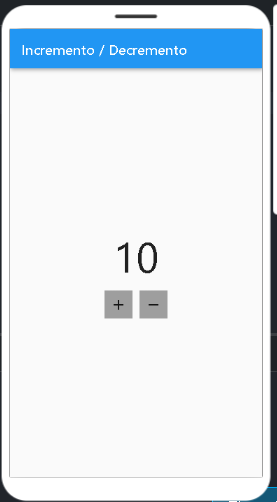
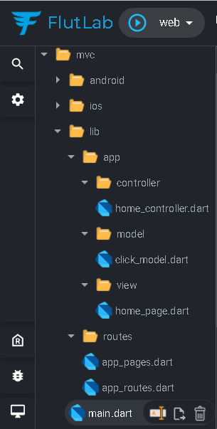

# MVC com flutter

## Getting Started

- Este projeto é um ponto de partida para uma aplicação Flutter.
- Aprendendo MVC no flutter usando getx(https://pub.dev/packages/get) e a plataforma online FlutLab(https://flutlab.io);

Alguns recursos para começar se este for seu primeiro projeto Flutter:
- [Lab: Write your first Flutter app](https://flutter.dev/docs/get-started/codelab);
- [Cookbook: Useful Flutter samples](https://flutter.dev/docs/cookbook);
- [online documentation](https://flutter.dev/docs);

